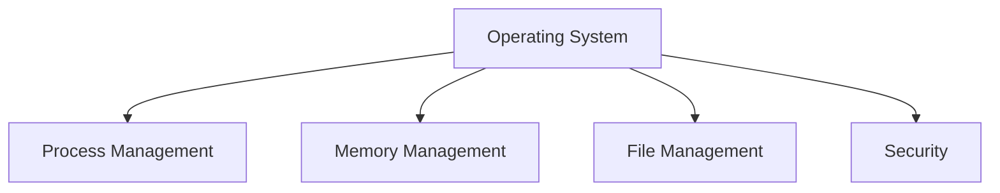

# ScholarOS — Advanced Scalable Architecture

## 1. Architecture Vision

ScholarOS is designed as an AI-powered academic operating system for students.

The architecture prioritizes:

- High performance
- Low latency
- Token efficiency
- AI cost optimization
- Horizontal scalability
- Reliable document processing
- RAG-based academic knowledge retrieval
- Offline-first functionality
- Strong security
- Modular services
- Free-tier-first deployment
- Smooth operation on low-end mobile and desktop devices

The core architectural principle is:

> **FastAPI provides intelligence, Rust provides high-performance computation, PostgreSQL provides the source of truth, pgvector provides semantic memory, Cloudflare provides the edge layer, and Next.js provides the user experience.**

---

# 2. High-Level Architecture

```text
                              ┌──────────────────────┐
                              │       STUDENTS       │
                              │ Web / Mobile / PWA   │
                              └──────────┬───────────┘
                                         │
                                         ▼
                              ┌──────────────────────┐
                              │   Next.js Frontend   │
                              │ React + TypeScript   │
                              │ PWA + Three.js       │
                              └──────────┬───────────┘
                                         │
                                         ▼
                              ┌──────────────────────┐
                              │    Cloudflare Edge   │
                              │ CDN + WAF + Cache    │
                              │ Rate Limiting        │
                              └──────────┬───────────┘
                                         │
                                         ▼
                              ┌──────────────────────┐
                              │    API Gateway       │
                              │ Authentication       │
                              │ Validation + Routing │
                              └──────────┬───────────┘
                                         │
                  ┌──────────────────────┼──────────────────────┐
                  │                      │                      │
                  ▼                      ▼                      ▼
          ┌──────────────┐       ┌──────────────┐       ┌──────────────┐
          │   FastAPI    │       │ Rust Engine  │       │ PostgreSQL   │
          │ AI + Logic   │       │ Processing   │       │  Supabase   │
          └──────┬───────┘       └──────┬───────┘       └──────┬───────┘
                 │                      │                      │
                 │                      │              ┌───────▼───────┐
                 │                      │              │    pgvector   │
                 │                      │              │ Semantic RAG  │
                 │                      │              └───────────────┘
                 │                      │
                 ▼                      ▼
          ┌──────────────┐       ┌──────────────┐
          │  AI Router  │       │   Document   │
          │ Token Manager│       │   Pipeline   │
          └──────┬───────┘       └──────────────┘
                 │
          ┌──────┼───────────────┐
          │      │               │
          ▼      ▼               ▼
       Cache    RAG          AI Models
                         Gemini / Other Models
```

---

# 3. Technology Stack

## Frontend

- Next.js
- React
- TypeScript
- Tailwind CSS
- Three.js
- PWA
- IndexedDB
- Client-side caching

## Edge Layer

- Cloudflare CDN
- Cloudflare Workers
- WAF
- Rate limiting
- Edge caching

## Backend

- Python
- FastAPI
- Pydantic
- asyncio
- HTTP/REST
- SSE for AI streaming only

## High-Performance Engine

- Rust
- Tokio
- Axum
- Serde

## Database

- PostgreSQL
- Supabase
- pgvector

## AI Layer

- AI Router
- Gemini
- RAG
- Semantic Cache
- Token Manager
- Structured Outputs
- Context Compression

## Storage

- Object storage
- PDF storage
- Generated documents
- Attachments

## Observability

- Structured logging
- OpenTelemetry
- Latency metrics
- AI token metrics
- Error tracking

---

# 4. Frontend Architecture

The frontend is responsible for the student experience.

```text
Next.js
│
├── Dashboard
├── AI Assistant
├── Attendance
├── Timetable
├── Study Planner
├── Notes Vault
├── PDF Vault
├── Knowledge Books
├── Quiz
├── Profile
└── Settings
```

The frontend should use:

- Server rendering where appropriate
- Static generation for public pages
- Client caching for frequently accessed data
- Lazy loading
- Code splitting
- Optimistic UI
- PWA caching
- IndexedDB for offline data

---

# 5. Three.js Performance Strategy

Three.js should not block the initial application load.

Bad:

```text
Page Load
   ↓
Load all 3D assets
   ↓
Initialize WebGL
   ↓
Load dashboard
```

Better:

```text
Page Load
   ↓
Critical UI
   ↓
Dashboard
   ↓
Lazy-load WebGL
   ↓
Load only required assets
```

Optimization techniques:

- Lazy-load 3D components
- Compress textures
- Reduce polygon counts
- Use efficient 3D formats
- Dispose unused resources
- Limit unnecessary animations
- Reduce rendering frequency when the page is inactive
- Provide a reduced-motion / low-performance mode

The application should remain usable even when WebGL is disabled.

---

# 6. Edge Layer

Cloudflare acts as the first layer between users and the application.

Responsibilities:

```text
User
 ↓
Cloudflare
 ├── CDN
 ├── WAF
 ├── Rate limiting
 ├── Cache
 ├── Request filtering
 └── Edge routing
 ↓
Backend
```

This reduces unnecessary traffic reaching the application servers.

Static resources should be cached aggressively:

- JavaScript
- CSS
- fonts
- images
- icons
- public documentation
- generated static assets

---

# 7. API Gateway

The API gateway provides a consistent entry point.

Example:

```text
/api/v1/auth
/api/v1/student
/api/v1/subjects
/api/v1/attendance
/api/v1/timetable
/api/v1/notes
/api/v1/documents
/api/v1/study-plans
/api/v1/ai
/api/v1/rag
```

Responsibilities:

- Authentication
- Authorization
- Request validation
- API versioning
- Rate limiting
- Routing
- Error normalization
- Request tracing

---

# 8. FastAPI AI Backend

FastAPI remains the main application and AI orchestration layer.

FastAPI handles:

- Authentication
- Student profiles
- Subjects
- Attendance
- Timetable
- Study plans
- Notes
- AI orchestration
- RAG orchestration
- AI model routing
- Token management
- Background job coordination

Python is retained because the AI and machine-learning ecosystem is extremely strong.

---

# 9. Rust High-Performance Engine

Rust is used selectively rather than replacing the entire backend.

Service:

```text
scholar-engine
```

Responsibilities:

- PDF processing
- Text extraction
- Text normalization
- Header/footer removal
- Duplicate detection
- Document chunking
- Markdown validation
- Large text transformation
- Compression
- CPU-heavy document processing

Architecture:

```text
FastAPI
   │
   ▼
Rust Engine
   │
   ├── PDF Parser
   ├── Text Cleaner
   ├── Chunker
   ├── Document Analyzer
   ├── Markdown Validator
   └── Compression
```

Rust provides:

- Native performance
- Low memory overhead
- Strong compile-time safety
- Excellent concurrency
- No traditional garbage collector
- Efficient CPU utilization

Rust should not be used simply because it is faster.

It should be used where CPU performance and concurrency materially matter.

---

# 10. AI Router

Every AI request should pass through an AI Router.

```text
                         AI Request
                              │
                              ▼
                       ┌─────────────┐
                       │  AI Router  │
                       └──────┬──────┘
                              │
              ┌───────────────┼───────────────┐
              │               │               │
              ▼               ▼               ▼
            Cache          Simple          Complex
              │               │               │
              ▼               ▼               ▼
            Return        Fast Model      Strong Model
```

The router evaluates:

- Task complexity
- Context size
- User quota
- Required latency
- Available model
- Cache availability
- RAG requirements
- Output requirements

---

# 11. Token Manager

The Token Manager is responsible for minimizing AI token consumption.

```text
┌────────────────────────────────┐
│         TOKEN MANAGER           │
├────────────────────────────────┤
│ Context Budget                  │
│ Output Budget                   │
│ Conversation Compression        │
│ RAG Filtering                   │
│ Semantic Cache                  │
│ Model Routing                   │
│ User Quotas                     │
│ Token Tracking                  │
└────────────────────────────────┘
```

Every AI request passes through this layer.

---

# 12. Token Optimization Strategy

## Avoid full conversation history

Instead of sending:

```text
100 previous messages
+
new message
```

use:

```text
Conversation Summary
+
Recent Messages
+
Relevant Context
+
New Message
```

Example:

```text
CONVERSATION SUMMARY:
Student is studying Operating Systems.
Current topic is CPU Scheduling.
Student understands processes.
Student needs beginner-friendly explanations.

RECENT:
User: Explain Round Robin scheduling.
```

---

# 13. Rolling Conversation Summaries

When a conversation becomes large:

```text
Long Conversation
      ↓
Summarizer
      ↓
Compact Summary
      ↓
Old Messages Archived
```

Keep:

```text
Summary
+
Recent Messages
+
Relevant Knowledge
```

This prevents context growth.

---

# 14. RAG Architecture

ScholarOS should use Retrieval-Augmented Generation for uploaded academic material.

```text
PDF
 ↓
Rust Document Engine
 ↓
Text Extraction
 ↓
Cleaning
 ↓
Chunking
 ↓
Embeddings
 ↓
PostgreSQL + pgvector
```

When a student asks a question:

```text
Question
 ↓
Embedding
 ↓
Vector Search
 ↓
Relevance Filtering
 ↓
Context Compression
 ↓
AI Model
 ↓
Answer
```

The complete PDF should never be repeatedly inserted into the AI context.

---

# 15. RAG Relevance Filtering

Retrieved chunks should be filtered.

Example:

```text
Chunk 1 → 0.94
Chunk 2 → 0.89
Chunk 3 → 0.83
Chunk 4 → 0.48
Chunk 5 → 0.31
```

Only sufficiently relevant chunks should be passed to the model.

This reduces:

- Input tokens
- Latency
- Noise
- Hallucination risk

---

# 16. Semantic Cache

ScholarOS should cache semantically similar questions.

For example:

```text
"Explain binary search"

"How does binary search work?"

"Teach me binary search"
```

These requests may represent the same underlying educational intent.

Pipeline:

```text
Question
 ↓
Embedding
 ↓
Semantic Cache
 ↓
Similar answer found?
 ├── YES → Return cached result
 └── NO  → AI generation
```

Personalized answers should use user-specific cache keys.

---

# 17. Model Routing

Use different models for different workloads.

### Simple tasks

Examples:

```text
What is RAM?
Define CPU.
Convert this into bullets.
Summarize this paragraph.
```

Use a fast/low-cost model.

### Medium tasks

```text
Explain process scheduling.
Create revision notes.
Generate quiz questions.
```

Use a standard model.

### Complex tasks

```text
Analyze multiple textbooks.
Create a detailed academic curriculum.
Generate a large knowledge book.
```

Use a stronger model.

---

# 18. Structured AI Output

AI should produce structured data for internal operations.

Example:

```json
{
  "title": "Operating Systems",
  "chapters": [
    {
      "id": 1,
      "title": "Introduction",
      "objectives": [
        "Define operating systems",
        "Explain operating system functions"
      ]
    }
  ]
}
```

The application then converts the structured output into the final UI or document.

This prevents the model from controlling application logic through uncontrolled prose.

---

# 19. AI Knowledge Book Generator

ScholarOS should support:

```text
Topic → Complete Study Book
```

Example:

```text
Student:
"Create a detailed study book about Operating Systems."
```

Pipeline:

```text
Topic
 ↓
Topic Analyzer
 ↓
Course Planner
 ↓
Structured Outline
 ↓
Chapter Generator
 ↓
Chapter Validator
 ↓
Knowledge Graph
 ↓
Markdown Builder
 ↓
HTML Renderer
 ↓
PDF Renderer
 ↓
RAG Index
```

---

# 20. Chapter-Based Generation

Never generate a 40-page document in one AI request.

Instead:

```text
Topic
 ↓
Outline
 ↓
Chapter 1
 ↓
Validate
 ↓
Chapter 2
 ↓
Validate
 ↓
Chapter 3
 ↓
Validate
 ↓
...
 ↓
Final Document
```

Benefits:

- Smaller prompts
- Lower failure probability
- Easier retries
- Better quality control
- Better token management
- Progress tracking
- Partial regeneration

---

# 21. Knowledge Book Structure

Generated books should contain:

```text
Title
Table of Contents

Chapter 1
 ├── Concepts
 ├── Examples
 ├── Key Ideas
 └── Summary

Chapter 2
 ├── Concepts
 ├── Examples
 ├── Diagrams
 └── Summary

...

Revision
 ├── Important Definitions
 ├── Quick Revision
 ├── 2-Mark Questions
 ├── 5-Mark Questions
 └── 10-Mark Questions
```

---

# 22. Markdown as the Source Format

AI generates Markdown rather than PDF.

Example:

```markdown
# Operating Systems

## 1. Introduction

An operating system is system software...

## 1.1 Functions

- Process management
- Memory management
- File management

## Example

```python
print("Hello")
```

## Summary

- ...
```

Then:

```text
Markdown
 ↓
HTML
 ↓
CSS
 ↓
PDF
```

No AI tokens are needed for page layout.

---

# 23. Mathematical Content

Technical documents should support LaTeX.

Example:

```markdown
The linear equation is:

$$
y = mx + b
$$
```

Useful for:

- Mathematics
- Statistics
- Physics
- Machine Learning
- Engineering
- Computer Science

---

# 24. Diagram Generation

Markdown documents can contain Mermaid diagrams.

Example:



These diagrams can be converted into SVG or image assets during PDF generation.

---

# 25. Document Processing Pipeline

```text
                 PDF Upload
                     │
                     ▼
              Rust Document Engine
                     │
          ┌──────────┼──────────┐
          ▼          ▼          ▼
       Extract     Clean      Metadata
          │          │          │
          └──────────┼──────────┘
                     ▼
                  Chunking
                     │
                     ▼
                 Embeddings
                     │
                     ▼
              PostgreSQL/pgvector
```

The same pipeline can process:

- Textbooks
- Lecture notes
- Assignments
- Question papers
- Research papers
- Student-generated books

---

# 26. Background Job Architecture

Long-running tasks should not block API requests.

Bad:

```text
Upload PDF
 ↓
HTTP request stays open
 ↓
Extract
 ↓
Chunk
 ↓
Embed
 ↓
Return
```

Better:

```text
Upload PDF
 ↓
Return document_id
 ↓
Queue job
 ↓
Worker
 ↓
Extract
 ↓
Chunk
 ↓
Embed
 ↓
Index
 ↓
status = ready
```

Example states:

```text
uploaded
queued
processing
extracting
chunking
embedding
indexing
ready
failed
```

---

# 27. Database Architecture

PostgreSQL is the source of truth.

Core tables:

```text
users
profiles
subjects
attendance
timetable
assignments

documents
document_chunks

courses
chapters
sections

notes
study_plans
study_blocks

conversations
messages
conversation_summaries

ai_requests
ai_usage
ai_cache

knowledge_nodes
knowledge_edges
```

Important indexes:

```text
user_id
subject_id
document_id
created_at
status
```

Vector indexes should be used for semantic retrieval.

---

# 28. Object Storage

Large files should not be stored directly inside normal database records.

Use object storage for:

```text
PDFs
Images
Attachments
Generated PDFs
Generated books
```

PostgreSQL stores metadata:

```text
document_id
user_id
filename
size
storage_path
status
created_at
```

---

# 29. Multi-Level Caching

Use multiple cache layers.

```text
Browser Cache
      ↓
CDN Cache
      ↓
Application Cache
      ↓
Semantic AI Cache
      ↓
PostgreSQL
```

Frequently accessed data should not repeatedly reach the database.

---

# 30. Offline-First Architecture

ScholarOS should remain useful without a continuous connection.

Use:

```text
Next.js PWA
+
IndexedDB
```

Cache locally:

- Timetable
- Notes
- Study plans
- Recent AI answers
- Attendance information

Offline:

```text
Read notes
View timetable
View study plan
View cached information
```

When the connection returns:

```text
Local Changes
 ↓
Sync Engine
 ↓
Server
 ↓
Conflict Resolution
```

---

# 31. Attendance System

Attendance calculations should never require AI.

```text
Attendance Records
 ↓
FastAPI
 ↓
Local Calculation
 ↓
Result
```

Example:

```text
Attendance = attended_classes / total_classes × 100
```

AI is unnecessary for deterministic calculations.

---

# 32. Study Planner

The planner should use a hybrid system.

```text
Student Data
 ↓
Rule Engine
 ↓
AI Planner
 ↓
Validation
 ↓
Study Plan
```

Deterministic constraints should be handled by code.

AI should handle:

- prioritization
- explanations
- recommendations
- adaptive planning

---

# 33. API Optimization

Normal CRUD operations should use HTTP/JSON.

Use streaming only when necessary.

```text
CRUD:
HTTP JSON

AI response:
SSE / streaming
```

This prevents unnecessary persistent connections.

---

# 34. Frontend Request Optimization

Use:

- Debouncing
- Request deduplication
- Client-side caching
- Pagination
- Lazy loading
- Optimistic updates

Example:

```text
User types search
      ↓
300 ms debounce
      ↓
API request
```

Not:

```text
Every keystroke
 ↓
API request
```

---

# 35. Pagination

Never load unlimited records.

Bad:

```sql
SELECT * FROM notes;
```

Better:

```sql
SELECT *
FROM notes
LIMIT 20;
```

Use cursor-based pagination for large datasets.

Apply pagination to:

- Notes
- Documents
- Conversations
- Attendance history
- Study blocks
- Generated books

---

# 36. Stateless Backend

FastAPI services should remain stateless.

Do not store important user state only in server memory.

Instead:

```text
Request
 ↓
Authenticate
 ↓
Database/Cache
 ↓
Process
 ↓
Response
```

This allows multiple API instances to run simultaneously.

```text
                 Load Balancer
                /      |      \
               ▼       ▼       ▼
            API 1    API 2    API 3
               \       |       /
                \      |      /
                 PostgreSQL
```

---

# 37. Horizontal Scaling

When usage grows:

```text
                 Edge
                   │
                   ▼
             Load Balancer
                   │
       ┌───────────┼───────────┐
       ▼           ▼           ▼
    FastAPI 1   FastAPI 2   FastAPI 3
       │           │           │
       └───────────┼───────────┘
                   │
              PostgreSQL
```

Because the backend is stateless, additional instances can be added without changing application logic.

---

# 38. AI Usage Tracking

Track:

```text
AI requests
Input tokens
Output tokens
Total tokens
Model
Latency
Cache hit
RAG context size
Errors
```

Example:

```text
AI Metrics

Requests/day
Average tokens/request
Cache hit rate
Average latency
RAG retrieval size
Model distribution
Failed requests
```

---

# 39. User Quotas

A free application needs resource protection.

Example:

```text
Free Student
 ├── AI requests/day
 ├── PDF uploads/day
 ├── Maximum PDF size
 ├── Storage quota
 └── Generation quota
```

The exact limits should be configurable rather than hard-coded.

---

# 40. Security

Every request should pass through:

```text
Authentication
 ↓
Authorization
 ↓
Input Validation
 ↓
Rate Limiting
 ↓
Business Logic
```

Security requirements:

- Never expose AI API keys to the frontend
- Validate uploaded files
- Restrict file sizes
- Sanitize Markdown/HTML
- Prevent malicious document content from becoming executable HTML
- Use row-level authorization for student data
- Keep service credentials server-side
- Apply least-privilege access
- Log security-relevant events

---

# 41. Observability

The system should expose metrics for:

```text
API latency
AI latency
Database latency
Rust worker latency
PDF processing time
Queue depth
Cache hit rate
Token consumption
Error rate
Active users
```

Every request should have a trace/request ID.

Example:

```text
Request ID
   ↓
Cloudflare
   ↓
FastAPI
   ↓
AI Router
   ↓
RAG
   ↓
Gemini
```

This makes performance problems traceable.

---

# 42. Performance Strategy

Optimization priorities:

## P0 — Highest impact

1. AI caching
2. RAG
3. Context compression
4. Token budgets
5. Model routing
6. Rate limiting
7. Database indexes
8. Pagination

## P1

9. Background document processing
10. Conversation summaries
11. Semantic cache
12. Frontend caching
13. CDN
14. Lazy loading
15. Stateless backend

## P2

16. Rust document engine
17. Knowledge graph
18. Offline synchronization
19. Horizontal scaling
20. Advanced observability

---

# 43. Free-Tier-First Strategy

The architecture should maximize users per available quota.

Potential initial infrastructure:

```text
Frontend
   ↓
Cloudflare
   ↓
Next.js
   ↓
FastAPI
   ↓
Supabase PostgreSQL
   ├── Application data
   ├── pgvector
   └── Object storage
   ↓
AI Provider
```

Rust processing can initially run as part of a worker deployment and later become an independent service.

Free-tier limits must be treated as quotas rather than unlimited capacity.

---

# 44. Recommended Service Boundaries

Do not begin with dozens of microservices.

Start with:

```text
1. Frontend
2. FastAPI application
3. Rust document engine
4. PostgreSQL/Supabase
5. Object storage
6. AI provider
```

Only split services further when monitoring proves it is necessary.

---

# 45. Final Production Architecture

```text
                             STUDENTS
                                │
                                ▼
                    ┌─────────────────────┐
                    │ Next.js / PWA       │
                    │ React + TypeScript  │
                    │ Three.js            │
                    └──────────┬──────────┘
                               │
                               ▼
                    ┌─────────────────────┐
                    │ Cloudflare Edge     │
                    │ CDN / WAF / Cache   │
                    │ Rate Limiting       │
                    └──────────┬──────────┘
                               │
                               ▼
                    ┌─────────────────────┐
                    │    API Gateway      │
                    │ Auth / Validation   │
                    │ Routing / Security  │
                    └──────────┬──────────┘
                               │
             ┌─────────────────┼─────────────────┐
             │                 │                 │
             ▼                 ▼                 ▼
      ┌────────────┐    ┌────────────┐    ┌──────────────┐
      │  FastAPI   │    │ Rust       │    │ PostgreSQL   │
      │ AI + Logic │    │ Engine     │    │  Supabase    │
      └─────┬──────┘    └─────┬──────┘    └──────┬───────┘
            │                 │                  │
            │                 │           ┌──────▼──────┐
            │                 │           │  pgvector   │
            │                 │           │    RAG      │
            │                 │           └─────────────┘
            │                 │
            │          ┌──────▼────────┐
            │          │ PDF / Text    │
            │          │ Processing     │
            │          └───────────────┘
            │
            ▼
      ┌──────────────┐
      │ Token Manager│
      └──────┬───────┘
             │
      ┌──────┼───────────────┐
      │      │               │
      ▼      ▼               ▼
   Cache    RAG          AI Router
                           │
                    ┌──────┼──────┐
                    ▼      ▼      ▼
                  Fast   Standard Strong
                  Model   Model    Model
                    │      │      │
                    └──────┼──────┘
                           ▼
                       AI Provider
```

---

# 46. Architectural Principles

ScholarOS should follow these principles:

### 1. AI is not the database

AI generates and interprets information.

The database remains the source of truth.

### 2. Don't use AI for deterministic operations

Attendance calculations, CRUD, filtering, validation, and scheduling constraints should use normal code.

### 3. Don't send unnecessary context

Only relevant information should enter an AI prompt.

### 4. Don't generate huge documents in one request

Generate chapter-by-chapter.

### 5. Cache aggressively

Repeated work should become a cache lookup.

### 6. Use Rust selectively

Use Rust where CPU performance and concurrency matter.

### 7. Keep the backend stateless

This enables horizontal scaling.

### 8. Keep infrastructure simple

Start with a small number of services and split only when justified by measurements.

### 9. Design for quotas

A free-tier application must treat AI, compute, storage, and bandwidth as finite resources.

### 10. Optimize for the student experience

The system should feel instant even when expensive AI work is happening asynchronously.

---

# 47. ScholarOS End Goal

The final system should behave like:

```text
                  SCHOLAROS
                      │
       ┌──────────────┼──────────────┐
       ▼              ▼              ▼
     LEARN          PLAN           TRACK
       │              │              │
       ▼              ▼              ▼
      AI            Planner       Attendance
       │              │              │
       └──────────────┼──────────────┘
                      │
                      ▼
                 KNOWLEDGE
                      │
       ┌──────────────┼──────────────┐
       ▼              ▼              ▼
      PDFs           Notes          Books
       │              │              │
       └──────────────┼──────────────┘
                      ▼
                    RAG
                      │
                      ▼
                AI Assistant
                      │
                      ▼
              Personalized Learning
```

The objective is not simply to create another AI chatbot.

> **ScholarOS should become a persistent, searchable, adaptive academic knowledge system where the student's documents, notes, study plans, attendance, learning history, and AI assistance work together.**